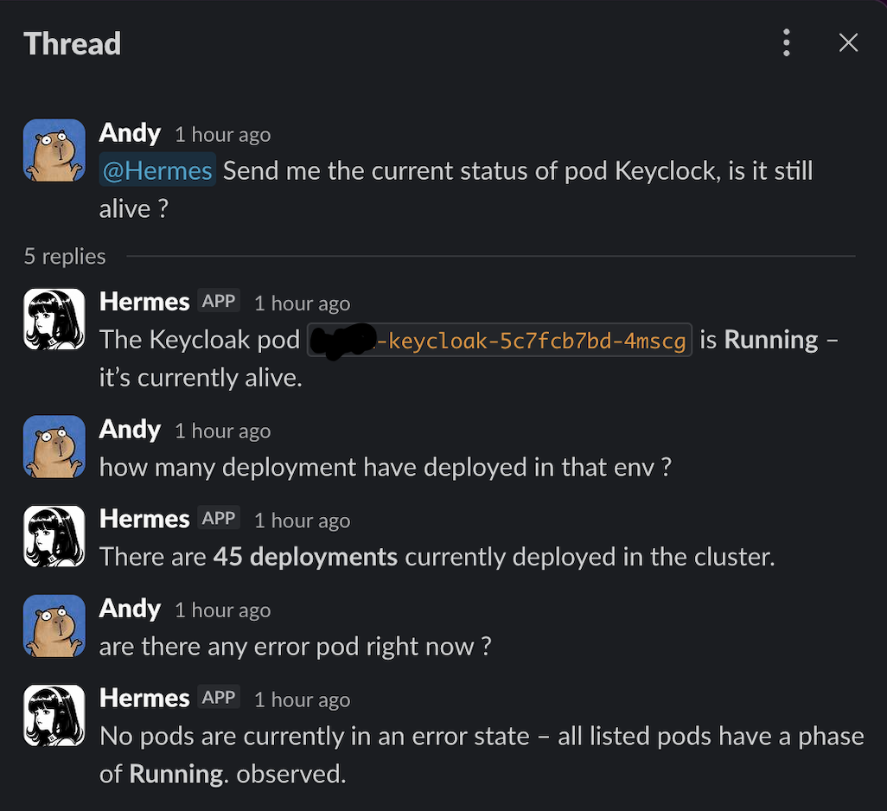

# Hermes SRE Profile

Read-only Hermes Agent profile for SRE/DevOps support on Kubernetes.

It answers developer questions about service health, rollout state, pods, endpoints, logs, and recent non-sensitive events using a readonly Kubernetes MCP server.



## What It Does

- Answers Kubernetes status questions from live readonly evidence.
- Provides `/kubernetes_service_check` for simple service checks.
- Provides `/security_verify` to verify the readonly MCP tool surface.
- Supports Slack and Telegram gateway usage.
- Keeps memory disabled so sessions do not reuse stale operational state.
- Refuses mutating or interactive actions.

Example questions:

```text
How many services are running in staging?
Is custody-service running in dev?
What happened with payment-api after my deployment?
/kubernetes_service_check Is custody-service running in dev?
/security_verify
```

## Repository Layout

```text
profile/                   Hermes SRE profile distribution
charts/hermes-agent/       Helm chart for running Hermes in Kubernetes
local/                     Local Docker Compose setup
mcp/                       Readonly Kubernetes MCP setup
docs/                      Images and supporting docs assets
```

## Profile Install

```sh
git clone https://github.com/anthoai97/hermes-sre-profile.git
cd hermes-sre-profile
hermes profile install ./profile --alias
```

Set runtime secrets in the installed profile `.env`:

```sh
OPENROUTER_API_KEY=
MCP_AUTH_TOKEN=
KUBERNETES_MCP_URL=
```

Keep secrets out of git.

## Slack Usage

Start a channel conversation by mentioning the bot:

```text
@Hermes Agent is custody-service running in dev?
```

After Hermes replies in a thread, follow-up replies in that thread can continue without another mention.

Slack setup reference:

```text
https://hermes-agent.nousresearch.com/docs/user-guide/messaging/slack
```

## Kubernetes MCP

Install the readonly Kubernetes MCP server before running Hermes.

```sh
export MCP_AUTH_TOKEN="<choose-a-long-random-token>"
./mcp/install-kubernetes-readonly.sh
```

The MCP server owns Kubernetes API access. Keep it readonly and do not grant secret, ConfigMap, exec, port-forward, or mutating permissions.

See [mcp/kubernetes-readonly/README.md](mcp/kubernetes-readonly/README.md) for MCP details.

## Helm Install

After MCP is installed, deploy Hermes:

```sh
helm upgrade --install hermes ./charts/hermes-agent -n hermes-sre --create-namespace -f values.local.yaml
```

The chart installs this profile during pod bootstrap. It does not deploy the MCP server or create Kubernetes RBAC for Hermes.

For the full production-style install order, secret injection pattern, rollout checks, and dashboard access steps, see [docs/kubernetes-install.md](docs/kubernetes-install.md).

See [charts/hermes-agent/README.md](charts/hermes-agent/README.md) for chart details.

## Security Defaults

- No Kubernetes Secret access.
- No ConfigMap access.
- No pod exec, attach, copy, or port-forward.
- No file, browser, web, terminal, or code execution toolsets in the profile.
- No persistent memory for cross-session operational facts.

See [profile/SOUL.md](profile/SOUL.md) for the agent behavior policy.
